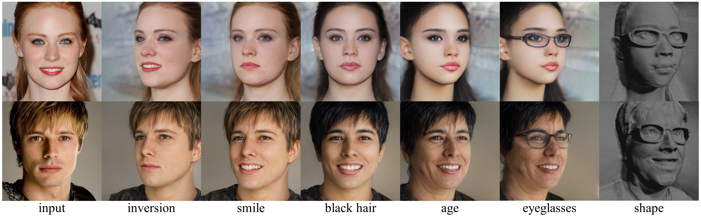
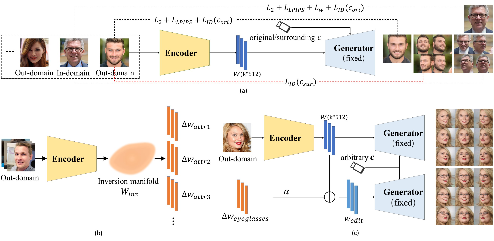

# PREIM3D: 3D Consistent Precise Image Attribute Editing from a Single Image (CVPR 2023)
[paper](https://arxiv.org/abs/2304.10263) | [project page](https://mybabyyh.github.io/Preim3D/) 

> We study the 3D-aware image attribute editing problem in this paper, which has wide applications in practice. Recent methods solved the problem by training a shared encoder to map images into a 3D generator's latent space or by per-image latent code optimization and then edited images in the latent space. Despite their promising results near the input view, they still suffer from the 3D inconsistency of produced images at large camera poses and imprecise image attribute editing, like affecting unspecified attributes during editing. For more efficient image inversion, we train a shared encoder for all images. To alleviate 3D inconsistency at large camera poses, we propose two novel methods, an alternating training scheme and a multi-view identity loss, to maintain 3D consistency and subject identity. As for imprecise image editing, we attribute the problem to the gap between the latent space of real images and that of generated images. We compare the latent space and inversion manifold of GAN models and demonstrate that editing in the inversion manifold can achieve better results in both quantitative and qualitative evaluations. Extensive experiments show that our method produces more 3D consistent images and achieves more precise image editing than previous work.

<p align="center">

</p>

<!-- **Real-Time Editing**
<p align="center">
<video width="100%" controls><source src="https://mybabyyh.github.io/Preim3D/images/demo.mp4" type="video/mp4"></video>
</p> -->
## Description   
Official Implementation of "<a href="https://arxiv.org/abs/2304.10263">PREIM3D: 3D Consistent Precise Image Attribute Editing from a Single Image</a>" paper. 
The PREIM3D  enables reconstructing texture and geometry from a single real image within one second and allows one to perform a list of attributes editing sequentially.

## Introduction
we propose a pipeline that enables PRecise Editing in the Inversion Manifold with 3D consistency efficiently, termed PREIM3D. 

 

## Getting Started
### Environment
The environment can be set up from the provided `environment.yml`:
```
conda env create -f environment.yml
```

### Pretrained Models
Please download our pre-trained models from the following links and put it in `./pretrained`.
| Path | Description
| :--- | :----------
|[PREIM3D FFHQ](https://drive.google.com/file/d/1_s-ywlNPNGg1_ZyzataHt6Y4qS0Pp4ce/view?usp=sharing)  | FFHQ PREIM3D inversion encoder.

We also provide other models needed for inference and training and put it in ./pretrained.
| Path | Description
| :--- | :----------
|[EG3D Generator](https://drive.google.com/file/d/1tFfynggbcITiKF_iLBcFutBSMCScBPSa/view?usp=sharing) | EG3D generator model pretrained on FFHQ taken from [EG3D](https://github.com/NVlabs/eg3d) with 512x512 output resolution.
|[IR-SE50 Model](https://drive.google.com/file/d/1KW7bjndL3QG3sxBbZxreGHigcCCpsDgn/view?usp=sharing) | Pretrained IR-SE50 model taken from [TreB1eN](https://github.com/TreB1eN/InsightFace_Pytorch) for use in our ID loss during training.
|[MOCOv2 Model](https://drive.google.com/file/d/18rLcNGdteX5LwT7sv_F7HWr12HpVEzVe/view?usp=sharing) | Pretrained ResNet-50 model trained using MOCOv2 for use in our simmilarity loss for domains other then human faces during training.
|[Editing Directions](https://drive.google.com/file/d/1Y21Is8hvTHbNzaym7dkXP025AIbuBYre/view?usp=sharing) | Portrait attribute editing directions computed in the inversion manifold using PREIM3D.

## Inference
### Prepare Images
**FFHQ**: Download and preprocess the Flickr-Faces-HQ dataset following EG3D. Note, the cropping is different from the original FFHQ.

**Custom dataset**: You can process your own dataset following EG3D. See [EG3D](https://github.com/NVlabs/eg3d) for alignment details.

We put some test images in `./data/test`, and you can quickly try them.  
### Script
You can use `inference.sh` to apply the model on a set of images.   
```
./inference.sh
```
### Interactive visualization
We provide a web demo for interactive editing tool. To start it, run:

```
python web_demo.py
```

## Training

### Training on your own dataset
We train PREIM3D on FFHQ cropped by to EG3D. Please configure the dataset in `configs/paths_config.py` and `configs/data_configs.py`

### Script
You can use `train.sh` to train the model.   
```
./train.sh
```
If you want to finetune the model, you can add `--checkpoint_path`.
## Acknowledgments
Thanks to [omertov](https://github.com/omertov/encoder4editing) and [EG3D](https://github.com/NVlabs/eg3d)for sharing their code.

## Citation
If you use this code for your research, please cite:

```
@InProceedings{Li_2023_CVPR,
    author    = {Li, Jianhui and Li, Jianmin and Zhang, Haoji and Liu, Shilong and Wang, Zhengyi and Xiao, Zihao and Zheng, Kaiwen and Zhu, Jun},
    title     = {PREIM3D: 3D Consistent Precise Image Attribute Editing From a Single Image},
    booktitle = {Proceedings of the IEEE/CVF Conference on Computer Vision and Pattern Recognition (CVPR)},
    month     = {June},
    year      = {2023},
    pages     = {8549-8558}
}
```
